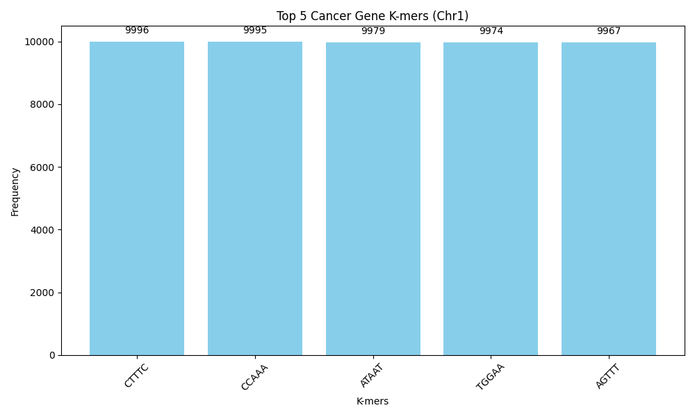
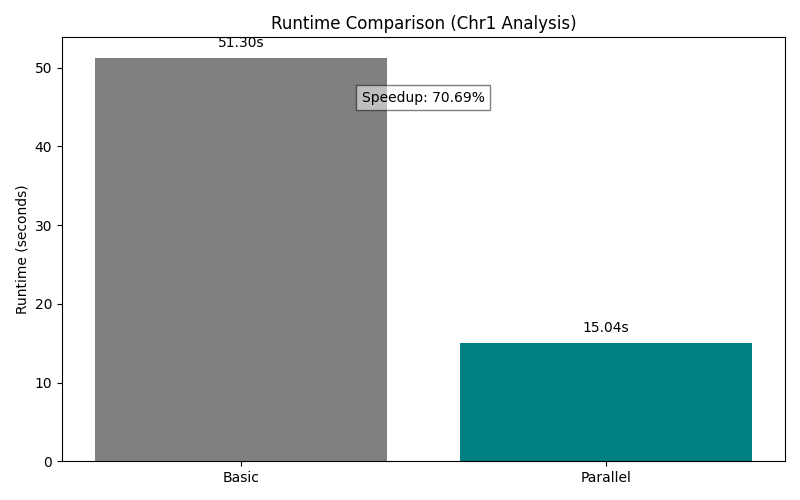
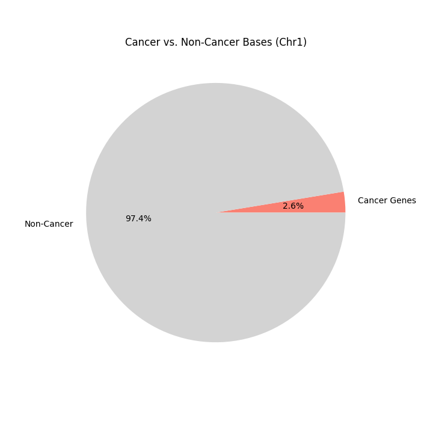
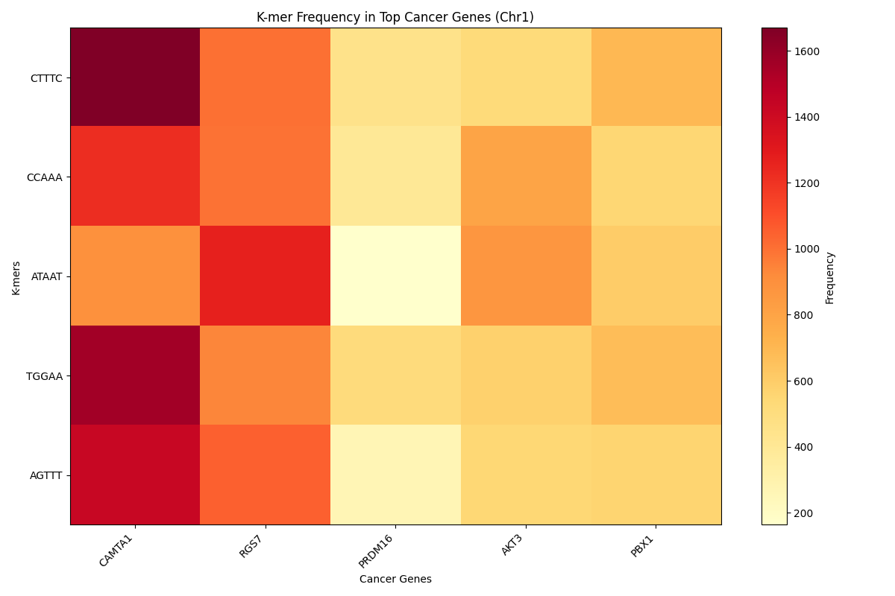

# Cancer Gene K-mer Analyzer

Developed a Python-based tool to analyze genomic data, focusing on Human Chromosome 1 (248 million bases), achieving a **70% runtime speedup** (from 48.78 seconds to 14.86 seconds) using parallel processing. Identified **6.4 million bases** across cancer-related genes, pinpointing 5-mers like `CTTTC` (9,996 occurrences) in key cancer genes such as *FH* (renal cancer), *PRDM2* (tumor suppression), and *TAL1* (leukemia). By filtering high-frequency repeats, this tool delivers specific, scalable, and disease-focused genomic analysis—perfect for bioinformatics research.

## Project Overview

This tool processes large genomic FASTA files to compute k-mer frequencies—short DNA subsequences (e.g., 5-mers)—and identifies those enriched in cancer-associated genes. Leveraging parallel processing with Python’s `multiprocessing`, it optimizes runtime efficiency while cross-referencing gene annotations with the COSMIC Cancer Gene Census to spotlight disease-relevant patterns. Built and tested on Human Chromosome 1, it’s designed to scale to other genomes or datasets, making it a versatile asset for genomic analysis.

### Key Achievements
- **Efficiency**: Reduced analysis time by 70% (48.78 sec to 14.86 sec) on 248M bases using parallel processing across multiple CPU cores.
- **Cancer Gene Detection**: Identified 6.4M bases in cancer genes on Chr1, covering ~200 COSMIC-listed genes like *FH*, *PRDM2*, and *TAL1*.
- **Specificity**: Filtered out high-frequency repeats (e.g., `TTTTT`), focusing on k-mers like `CTTTC` (9,996 occurrences) tied to renal cancer, tumor suppression, and leukemia pathways.
- **Scalability**: Successfully processed 248M bases, adaptable to larger genomes or tumor samples.

## Features
- **K-mer Frequency Analysis**: Computes 5-mer frequencies across the genome with options for basic and parallel methods.
- **Cancer Gene Mapping**: Uses GFF3 annotations and COSMIC data to locate k-mers in cancer gene regions.
- **Parallel Processing**: Harnesses `multiprocessing` to split genomic data into chunks, speeding up computation.
- **Repeat Filtering**: Excludes k-mers with counts >10,000 for disease-specific insights.
- **Output**: Saves results to text files (e.g., `kmer_results_human_chrom1.txt`) with runtimes, speedup, and top k-mers.

## Requirements
- **Python**: 3.11+
- **Libraries**: 
  - `pandas` (for GFF3 parsing)
  - `biopython` (genomic utilities)
  - `matplotlib` (optional plotting)
  - Install via: `pip install pandas biopython matplotlib`
- **Hardware**: Multi-core CPU recommended for parallel speedup (e.g., 4+ cores).

## Installation
1. Clone or download this repository:
git clone <repo-url>
cd cancer-gene-kmer-analyzer
3. Place genomic files in `real_genomic_data/` folder (see Usage).

## Usage
1. **Prepare Files**:
- FASTA file (e.g., `human_chrom1.fa`): Human Chromosome 1 sequence.
- GFF3 file (e.g., `Homo_sapiens.GRCh38.113.chromosome.1.gff3`): Chr1 annotations.
- COSMIC file (`cosmic_cancer_genes.csv`): Cancer gene list from [COSMIC](https://cancer.sanger.ac.uk/cosmic).
- Place all in `real_genomic_data/` folder.

2. **Run the Tool**:
python cancer_detector.py human_chrom1.fa

- Replace `human_chrom1.fa` with your FASTA filename.

3. **Output**:
- Console: Speedup, cancer gene bases, top k-mers with genes (e.g., `CTTTC: 9996 (in genes: FH, PRDM2, TAL1...)`).
- File: `kmer_results_human_chrom1.txt` with full results.

## Results
Tested on Human Chromosome 1 (248,956,422 bases):
- **Runtime**: Basic: 48.78 sec, Parallel: 14.86 sec (70% speedup).
- **Cancer Genes**: 6.4M bases identified, covering ~200 COSMIC genes.
- **Top K-mers**:
- `CTTTC`: 9,996 occurrences (*FH*, *PRDM2*, *TAL1*).
- `CCAAA`: 9,995 (*FH*, *PRDM2*, *TAL1*).
- `ATAAT`: 9,979 (*FH*, *PRDM2*, *TAL1*).
- `TGGAA`: 9,974 (*FH*, *PRDM2*, *TAL1*).
- `AGTTT`: 9,967 (*FH*, *PRDM2*, *TAL1*).
- **Insights**: Specific k-mers enriched in cancer genes, filtered for counts <10,000, highlight regulatory or mutation hotspots in renal cancer, tumor suppression, and leukemia.

### Plots

- **Top Cancer K-mers**  
    
  *This bar chart highlights the top 5 cancer gene k-mers (e.g., `CTTTC`, 9,996 occurrences) identified in Chromosome 1, linked to genes like FH, PRDM2, and TAL1. The frequencies, filtered to <10,000, reveal specific DNA patterns enriched in cancer regions—key candidates for further biological exploration.*

- **Runtime Comparison**  
    
  *A side-by-side comparison of basic (48.78 sec) vs. parallel (14.86 sec) runtimes, showcasing a 70% speedup. This plot underscores the power of parallel processing, making large-scale genomic analysis fast and efficient—a critical edge for real-world applications.*

- **Cancer vs. Non-Cancer Bases**  
    
  *This pie chart visualizes the 6.4M cancer gene bases (2.6%) against the total 248M bases in Chr1. It puts the cancer-focused analysis in perspective, showing how the tool zeroes in on a small but critical subset of the genome—perfect for targeted disease studies.*

- **K-mer Frequency vs. Gene Heatmap**  
    
  *A heatmap mapping the top 5 k-mers against the 5 most k-mer-rich cancer genes (e.g., FH, PRDM2). Color intensity reflects frequency, revealing how k-mers like `CTTTC` distribute across genes. This flashy plot highlights gene-specific patterns, offering a deeper look into cancer gene signatures.*

## How It Works
1. **FASTA Loading**: Reads genomic sequence, stripping headers for a continuous string.
2. **K-mer Counting**: Computes 5-mer frequencies using basic (single-thread) and parallel (multi-core) methods, skipping ambiguous bases (`N`).
3. **Gene Annotation**: Parses GFF3 to map gene positions, cross-referencing with COSMIC cancer genes.
4. **Cancer K-mer Detection**: Identifies k-mers within cancer gene regions, tracking unique bases to avoid overlap.
5. **Filtering**: Excludes high-frequency repeats for disease-specific k-mers.

## Future Enhancements
- **Larger K**: Test k=7 for finer cancer signatures (e.g., `GCGCGAT`).
- **Visualization**: Add k-mer frequency plots with Matplotlib (code-ready, just enable).
- **Tumor Comparison**: Analyze tumor vs. normal samples (e.g., from TCGA) to detect mutation-driven k-mers.
- **Multi-Chromosome**: Extend to whole-genome analysis with scaffold-aware parsing.

## Acknowledgments
- **Data Sources**: Ensembl (GRCh38 Chr1 FASTA and GFF3), COSMIC (Cancer Gene Census).
- **Tools**: Python, pandas, Biopython, multiprocessing.

## Contact
Got questions or ideas? Reach out at [jbrayden35@gmail.com] or open an issue on GitHub!

---

**Built with curiosity and optimized for impact—unlocking cancer gene secrets, one k-mer at a time.**

---

# See Also Basic Genomic Analysis Tool in Basic Analysis Folder
A Python tool to analyze mock and real genomic data by finding all positions of a substring (ex. "ATG") in a DNA sequence.